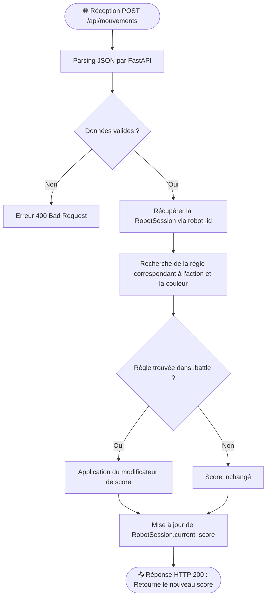

# ⚖️ Algorigramme Serveur Arbitre

Ce document modélise le processus de calcul du score lorsqu'un client (le robot) envoie un mouvement au serveur arbitre (Tâche #16).

## Diagramme de flux (Réception réseau → Calcul score)

## Description des étapes
1. **Réception** : Le robot effectue une action (ex: marche sur une case rouge) et l'envoie via `requests.post`.
2. **Validation** : Le serveur utilise Pydantic (modèle `MovementAction`) pour s'assurer que les données sont bonnes.
3. **Évaluation** : La méthode `BattleArbitre.evaluate_action()` vérifie si cette combinaison (action + couleur) rapporte ou fait perdre des points selon les règles du fichier `.battle`.
4. **Mise à jour & Retour** : Le score du robot est sauvegardé en mémoire et renvoyé au client pour affichage.