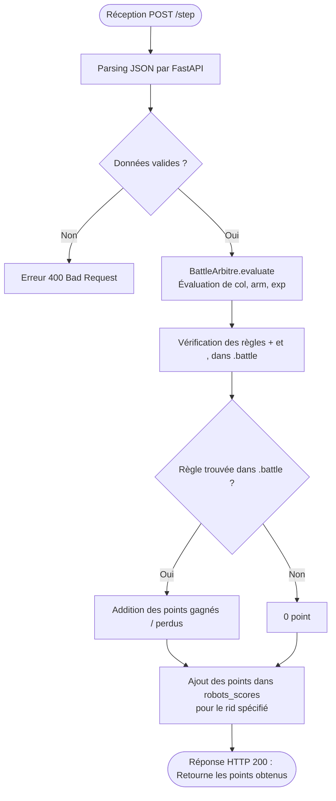

# Algorigramme Serveur Arbitre

Ce document modélise le processus de calcul du score lorsqu'un client (le robot) envoie un mouvement au serveur arbitre (Tâche #16).

## Diagramme de flux (Réception réseau → Calcul score)

```mermaid
graph TD
    Start([Réception POST /step]) --> Parse[Parsing JSON par FastAPI]
    Parse --> Valid{Données valides ?}
    
    Valid -- Non --> Err[Erreur 400 Bad Request]
    
    Valid -- Oui --> Evaluate["BattleArbitre.evaluate\nÉvaluation de col, arm, exp"]
    Evaluate --> Rule["Vérification des règles + et , dans .battle"]
    
    Rule --> Match{Règle trouvée dans .battle ?}
    
    Match -- Oui --> Calc[Addition des points gagnés / perdus]
    Match -- Non --> Skip[0 point]
    
    Calc --> Update[Ajout des points dans robots_scores\npour le rid spécifié]
    Skip --> Update
    
    Update --> End([Réponse HTTP 200 : Retourne les points obtenus])
```

## Description des étapes
1. **Réception** : Le robot se place sur une couleur et prend une posture, puis l'envoie via `requests.post` sur `/step`.
2. **Validation** : Le serveur utilise Pydantic (modèle `StepRequest`) pour s'assurer que `rid`, `col`, `arm` et `exp` sont présents.
3. **Évaluation** : La méthode `BattleArbitre.evaluate()` vérifie les combinaisons avec opérateurs (ET `+`, OU `,`) définies dans `.battle` pour la couleur correspondante.
4. **Mise à jour & Retour** : Les points obtenus sont ajoutés au dictionnaire partagé `robots_scores` et retournés au client.