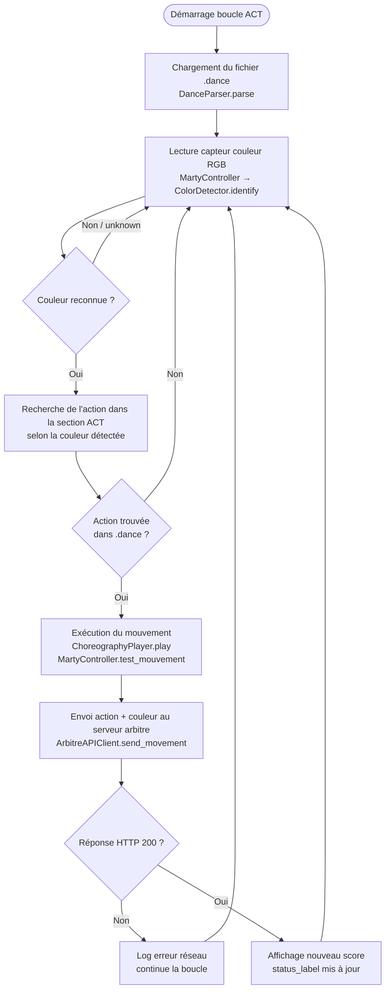

# Algorigramme Client — Boucle capteur → action (ACT)

Ce document modélise la boucle principale du robot client : lecture du capteur couleur,
sélection de l'action via le fichier `.dance`, exécution du mouvement et envoi au serveur
arbitre (Tâche #15).

## Diagramme de flux (Capteur → Mouvement → Arbitre)

## Description des étapes

1. **Chargement** : Au démarrage, `DanceParser.parse()` lit le fichier `.dance` et extrait
   la section `ACT` qui associe chaque couleur à une liste de mouvements.
2. **Lecture capteur** : `ColorDetector.identify(r, g, b)` convertit les valeurs RGB brutes
   en un nom de couleur (`red`, `green`, `blue`, `yellow`, `black`, `white`) par distance
   euclidienne dans l'espace RGB.
3. **Sélection de l'action** : La couleur détectée est cherchée dans la table ACT du fichier
   `.dance`. Si aucune correspondance n'existe, la boucle repart en lecture capteur.
4. **Exécution** : `ChoreographyPlayer.play()` passe la séquence de mouvements à
   `MartyController`, qui les transmet au robot Marty (ou à `MockMarty` en mode test).
5. **Envoi arbitre** : `ArbitreAPIClient.send_movement(action_type, color)` fait un POST
   vers le serveur FastAPI avec l'action et la couleur détectée.
6. **Réponse** : Le serveur retourne le nouveau score. L'interface `MainWindow` met à jour
   le `status_label`. En cas d'erreur réseau, la boucle continue sans bloquer le robot.

## Correspondance couleurs / codes .dance

| Code .dance | Couleur       |
|-------------|---------------|
| `N`         | Noir (black)  |
| `B`         | Bleu (blue)   |
| `R`         | Rouge (red)   |
| `P`         | Violet/Rose   |
| `Y`         | Jaune (yellow)|
| `G`         | Vert (green)  |
