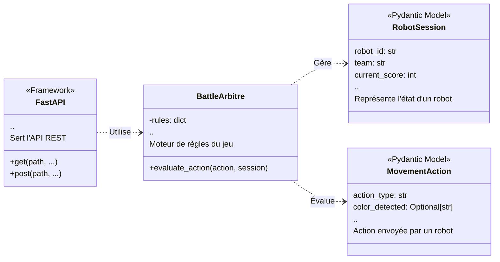

# Diagramme UML App Serveur

Architecture et les classes principales de l'application Serveur Arbitre (#12).

## Diagramme de Classes

```mermaid
classDiagram
    direction LR

    class FastAPI {
        <<Framework>>
        +get(path, ...)
        +post(path, ...)
        ..
        Sert l'API REST
    }

    class BattleArbitre {
        -rules: dict
        +evaluate_action(action, session)
        ..
        Moteur de règles du jeu
    }

    class RobotSession {
        <<Pydantic Model>>
        robot_id: str
        team: str
        current_score: int
        ..
        Représente l'état d'un robot
    }

    class MovementAction {
        <<Pydantic Model>>
        action_type: str
        color_detected: Optional[str]
        ..
        Action envoyée par un robot
    }

    FastAPI ..> BattleArbitre : Utilise
    BattleArbitre ..> RobotSession : Gère
    BattleArbitre ..> MovementAction : Évalue
```